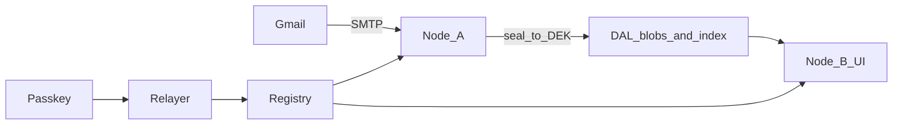

# open-email

[](https://github.com/naiemk/open-email/actions/workflows/ci.yml)
[](LICENSE)

```
   ____  ____  _____ _   _
  / __ \|  _ \| ____| \ | |
 | |  | | |_) |  _| |  \| |
 | |__| |  __/| |___| |\  |
  \____/|_|   |_____|_| \_|  email

  mailbox ──► name          (not a host)
  nodes   ──► doors         (you opt in)
  leave   ──► they go dark  (550)
```

**Gmail and Proton own the mailbox. We do not.**

Your **mailbox** is bound to a **name**, not to an SMTP host. Opt into any compatible **node**, see the same mail. Opt out, that **node** can no longer receive for you.

**Status.** The portability seam is proven: SMTP into **node** A, decrypt on B, **opt-out** on-chain, **registry** live on Base Sepolia. A public mailbox Gmail can send to is not shipped.

---

## Why they own it / why we don't

```
  THEIRS                              OURS
  ┌─────────────────┐                 ┌─────────────────┐
  │  alice@gmail    │                 │  name: alice    │
  │  ┌───────────┐  │                 │  (on registry)  │
  │  │  mailbox  │  │                 └────────┬────────┘
  │  │  locked   │  │                          │
  │  └───────────┘  │                 ┌────────┴────────┐
  │       ▲         │                 │       DAL       │
  │       │         │                 │  blobs + index  │
  │   one host      │                 └────────┬────────┘
  └─────────────────┘                    ┌─────┴─────┐
                                         ▼           ▼
                                    ┌────────┐  ┌────────┐
                                    │ node A │  │ node B │
                                    │ opted  │  │ opted  │
                                    └────────┘  └────────┘
                                         leave A ──► 550
```

Portability is the product.

- **Identity** lives in the open-email **registry** (a contract), not in a vendor database.
- **Mail blobs** and the **index** live on a shared **DAL** — not on one SMTP host.
- **Nodes** are doors. You **opt in** (and out) on-chain. A **node** you have not opted into answers the rest of the internet with **user does not exist**.

What we are **not** claiming: nation-state censorship resistance, E2EE of Gmail traffic, or names that work outside this ecosystem. Inbound and outbound SMTP with the rest of the internet is **plaintext at the opted-in node**, then encrypted at rest.

---

## How a message moves

```
  Gmail ──SMTP──► Node A ──seal──► DAL ──► Node B UI
                     ▲              ▲
                     │              │
              opt-in │         index│
                     │              │
  Passkey ──► Relayer ──► Registry ─┘
```



A **node** you have not **opted into** answers `550` user unknown.

---

## What's real vs next

```
  [████████████░░░░░░░░]  tracer proven · public MX not yet
```

**Real today**

- **Registry** (WebAuthn / P-256 controller, **OE id**, **opt-in** / **opt-out**)
- **Relayer** that posts those writes so you never see a wallet UI
- Two **nodes**: SMTP in, HPKE envelope, shared **index** + blobs
- Anvil tests + the same seam on Base Sepolia

**Next**

- Public MX, real passkeys, durable IPFS, SMTP-out
- A **name** a stranger on the internet can mail

**Not this project**

- IMAP / Apple Mail against a hosted store
- Minting `.eth` from this contract
- Claiming Gmail traffic is E2EE

---

## Run the tracer

Prerequisites: Node 22, [Foundry](https://book.getfoundry.sh/getting-started/installation) (`forge`, `anvil`).

```bash
npm ci
npm test
```

That *is* the demo: register a **name**, **opt in** to two **nodes**, SMTP into A, decrypt on B, **opt-out** stops new receive. Live L2 stays off unless you ask for it.

```bash
cp .env.example .env   # set EVM_PRIVATE_KEY; point L2_RPC_URL at Ethereum Sepolia
npm run test:l2        # RUN_L2_TESTS=1; needs a funded relayer key
```

---

## Contribute

Open a [GitHub issue](https://github.com/naiemk/open-email/issues). Read [IDEA.md](IDEA.md) for the brief and [CONTEXT.md](CONTEXT.md) for the language.

PRs that match the glossary and the honest boundaries land. IMAP and “make Gmail E2EE” do not.

---

## Docs

- [IDEA.md](IDEA.md) — design brief
- [CONTEXT.md](CONTEXT.md) — domain language
- [ADR: node is a provider](docs/adr/0001-node-is-a-provider.md)
- [Research notes](docs/research/)

## License

[MIT](LICENSE)
